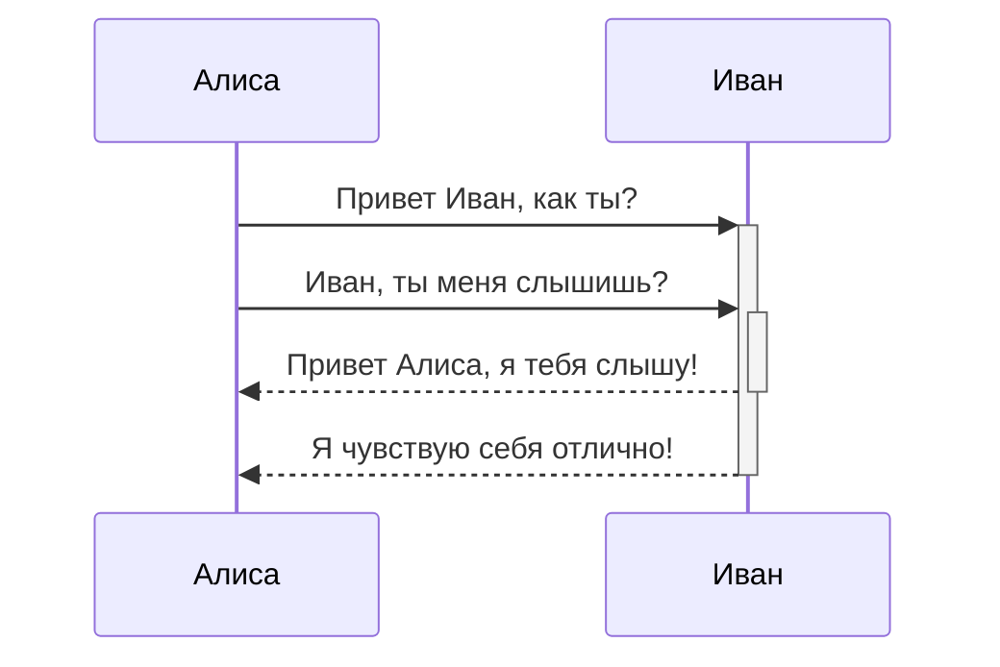

Obsidian это приложение для ведения заметок и базы знаний на основе Markdown-файлов.

На данный момент поддерживаются следующие элементы форматирования:

---

### Внутренние ссылки

```md
Ссылка на страницу: [[Внутренняя ссылка]].
```

Ссылка на страницу: [[Внутренняя ссылка]].

---

### Вложенные файлы

Вложение файла или заметки (узнать больше о [[Вложенные файлы|Вложенных файлах]]). Далее показан пример вложения раздела заметки об Obsidian:

```md
![[Obsidian#Что такое Obsidian]]
```

![[Obsidian#Что такое Obsidian]]

---

### Заголовки

```md
# Это заголовок 1
## Это заголовок 2
### Это заголовок 3
#### Это заголовок 4
##### Это заголовок 5
###### Это заголовок 6
```

# Это заголовок 1
## Это заголовок 2
### Это заголовок 3
#### Это заголовок 4
##### Это заголовок 5
###### Это заголовок 6

---

### Выделение

```md
*Этот текст отобразится курсивом*
_Этот текст отобразится курсивом_
```

*Этот текст отобразится курсивом*
_Этот текст отобразится курсивом_

```md
**Этот текст будет выделен жирным шрифтом**
__Этот текст тоже будет выделен жирным шрифтом__
```

**Этот текст будет выделен жирным шрифтом**
__Этот текст тоже будет выделен жирным шрифтом__

```md
_Их **можно** комбинировать_
```

_Их **можно** комбинировать_

---

### Списки

```md
- Предмет 1
- Предмет 2
  - Предмет 2a
  - Предмет 2b

1. Предмет 1
1. Предмет 2
1. Предмет 3
   1. Предмет 3a
   1. Предмет 3b
```

- Предмет 1
- Предмет 2
  - Предмет 2a
  - Предмет 2b

1. Предмет 1
1. Предмет 2
1. Предмет 3
   1. Предмет 3a
   1. Предмет 3b

--- 

### Изображения

```md

```


#### Изменение размера изображений

Пример уменьшения размера верхнего изображения до 100 пикселей в ширину:

```md

```


---

### Ссылки

#### Внешние ссылки

Ссылки типа Markdown можно использовать как для ссылки на внешние объекты вроде веб страниц, так и на внутренние страницы или изображения.

```md
http://obsidian.md - создаются автоматически!
[Obsidian](http://obsidian.md)
```

http://obsidian.md - создаются автоматически!
[Obsidian](http://obsidian.md)

#### Obsidian URI-ссылки

В Obsidian [[Использование протокола URI|URI-ссылки]] могут использоваться для открытия заметок из текущего хранилища, из другого хранилища или других программ.

Например, вы можете вставить ссылку на файл в хранилище таким образом (обратите внимание на [[Использование протокола URI#Encoding|обязательную кодировку]]):

```md
[Ссылка на файл](obsidian://open?path=D:%2Fpath%2Fto%2Ffile.md)
```

[Ссылка на файл](obsidian://open?path=D:%2Fpath%2Fto%2Ffile.md)

Вы так же можете вставить ссылку на файл указав имя хранилища и имя файла, без полного пути до него:

```md
[Ссылка на файл](obsidian://open?vault=MainVault&file=MyNote.md)
```

[Ссылка на файл](obsidian://open?vault=MainVault&file=MyNote.md)

#### Экранирование

Если в ссылках есть пробелы, они могут быть экранированы. Например, пробел можно заменить на код `%20`:

```md
[Импорт данных](Импорт%20данных)
```

[Импорт данных](Импорт%20данных)

Или заключить цель в скобки `<>`:

```md
[Ссылка на блоки](<Ссылка на блоки>)
```

[Ссылка на блоки](<Ссылка на блоки>)

---

### Цитирование

```md
> Люди сталкиваются со все более сложными и неотложными проблемами, и их эффективность в решении этих проблем имеет решающее значение для стабильности и дальнейшего прогресса общества.

\- Дуглас Энгельбарт, 1961
```

> Люди сталкиваются со все более сложными и неотложными проблемами, и их эффективность в решении этих проблем имеет решающее значение для стабильности и дальнейшего прогресса общества.

\- Дуглас Энгельбарт, 1961

---

### Встроенный код

```md
Текст внутри `обратных кавычек` в строке будет отображаться как код. 
```

Текст внутри `обратных кавычек` в строке будет отображаться как код. 

---

### Блоки кода

Подсветка синтаксиса поддерживается путем указания языка после первых трех обратных кавычек. Для подсветки мы используем prismjs, список поддерживаемых языков можно найти [на их сайте](https://prismjs.com/#supported-languages).

<pre><code>```js
function fancyAlert(arg) {
  if(arg) {
    $.facebox({div:'#foo'})
  }
}
```</code></pre>

```js
function fancyAlert(arg) {
  if(arg) {
    $.facebox({div:'#foo'})
  }
}
```  

```md
	Текст с отступом, сделанным с помощью табуляции, будет
	выглядеть как блок кода в области просмотра.
```

	Текст с отступом, сделанным с помощью табуляции, будет выглядеть как блок кода в области просмотра. 
    
---

### Список задач

```md
- [x] поддерживаются #теги, [ссылки](), **форматирование**
- [x] требуется синтаксис списка (поддерживаются упорядоченный или не упорядоченный списки)
- [x] это выполненная задача
- [ ] это не выполненная задача
- [ ] задачи в области просмотра помечаются выполненными при клике на чекбокс
```

- [x] поддерживаются #теги, [ссылки](), **форматирование**
- [x] используется синтаксис списка (поддерживаются упорядоченный или не упорядоченный списки)
- [x] это выполненная задача
- [ ] это не выполненная задача
- [ ] задачи в области просмотра помечаются выполненными при клике на чекбокс

---

### Таблицы

Вы можете создавать таблицы из списков слов. Шапка таблицы (первая строка) отделяется от остальных строк дефисами `-`. Столбцы разделяются вертикальной чертой `|`:

```md
Первый заголовок | Второй заголовок
------------ | ------------
Первый заголовок | Содержимое второй ячейки
Содержимое первой колонки | Содержимое второй колонки
```

Первый заголовок | Второй заголовок
------------ | ------------
Первый заголовок | Содержимое второй ячейки
Содержимое первой колонки | Содержимое второй колонки

---

```md
В таблицах поддерживается выравнивание | Еще один пример заголовка
:------------|------------:
с использованием двоеточия `:` | будет выровнено
```

В таблицах поддерживается выравнивание | Пример выравнивания
:------------|------------:
по краю с использованием двоеточия `:` | по правому краю

В таблицах работаю ссылки. Если в ссылке используется вертикальная черта,  она должна быть изолирована символом  `\`, чтобы не быть распознанной как элемент таблицы .

```md
Первый заголовок | Второй заголовок
------------ | ------------
[[Форматирование заметок\|Форматирование]]	|  [[Сочетание клавиш\|Горячие клавиши]]
```

Первый заголовок | Второй заголовок
------------ | ------------
[[Форматирование заметок\|Форматирование]]	|  [[Сочетание клавиш\|Горячие клавиши]]

---

### Зачеркивание

```md
Любой текст заключенный в двойные тильды (например, ~~так~~) будет отображаться как зачеркнутый.
```

Любой текст заключенный в двойные тильды (например, ~~так~~) будет отображаться как зачеркнутый.

---

### Подсветка

```md
Используя двойные знаки равенства можно ==подсветить текст==.
```

Используя двойные знаки равенства можно ==подсветить текст==.

---

### Сноски

```md
Пример простой сноки[^1] и пример сноски подлинее[^большая сноска].

[^1]: со смыслом!

[^большая сноска]: с несколькими абзацами и кодом.

    Делайте отступ перед абзацем чтобы включить его в сноску.

    `{ мой код }`

    Абзацев может быть сколько угодно.
```

Пример простой сноки[^1] и пример сноски подлинее.[^большая_сноска]

[^1]: со смыслом!

[^большая_сноска]: с несколькими абзацами и кодом.

	Делайте отступ перед абзацем чтобы включить его в сноску.
	`{ мой код }`
	Абзацев может быть сколько угодно.

```md
Сноски также можно оставлять прямо в тексте.^[обратите внимание, что карет `^` при этом выносится за скобки.]
```

Сноски также можно оставлять прямо в тексте.^[обратите внимание, что карет `^` при этом выносится за скобки.]

### Математические формулы

Вы можете добавлять в текст математические формулы.

Для отображения формулы в отдельном блоке, необходимо заключить ее в двойные `$$`:

```md
$$\begin{vmatrix}a & b\\
c & d
\end{vmatrix}=ad-bc$$
```

$$\begin{vmatrix}a & b\\
c & d
\end{vmatrix}=ad-bc$$

```md
Так же возможно отображение формулы внтури строки $e^{2i\pi} = 1$.
```

Так же возможно отображение формулы внтури строки $e^{2i\pi} = 1$.

Obsidian использует библиотеку [Mathjax](http://docs.mathjax.org/en/latest/basic/mathjax.html) для отображения математических формул. Вы можете ознакомиться со списком расширений поддерживаемых в Mathjax [тут](http://docs.mathjax.org/en/latest/input/tex/extensions/index.html).

### Комментарии

Используйте двойные `%%` для вложения комментариев, которые будут распознаны как Markdown-текст, но не будут показаны в режиме просмотра.

```md
Комментарий внутри текста: %%скрытый комментарий%% (который, не виден в режиме просмотра)

Скрытый блок с комментариями: (который, так же не виден в режиме просмотра)
%%
Он может содержать
множество строк
%%
```

Комментарий внутри текста: %%скрытый комментарий%% (который, не виден в режиме просмотра)

Скрытый блок с комментариями: (который, так же не виден в режиме просмотра)
%%
Он может содержать
множество строк
%%

### Диаграммы

Obsidian использует библиотеку [Mermaid](https://mermaid-js.github.io/) для отображения диаграмм и схем. У Mermaid есть удобный [«живой редактор»](https://mermaid-js.github.io/mermaid-live-editor).

<pre><code>```mermaid
sequenceDiagram
    Алиса->>+Иван: Привет Иван, как ты?
    Алиса->>+Иван: Иван, ты меня слышишь?
    Иван-->>-Алиса: Привет Алиса, я тебя слышу!
    Иван-->>-Алиса: Я чувствую себя отлично!
```</code></pre>



Obsidian поддерживает ссылки на заметки внутри элементов Mermaid:
<pre><code>```mermaid
graph TD

Биология --> Химия

class Биология,Химия internal-link;
```</code></pre>

Второй, но более простой способ: ^376b9d
<pre><code>```mermaid
graph TD

A[Биология]
B[Химия]

A --> B

class A,B,C,D,E,F,G,H,I,J,K,L,M,N,O,P,Q,R,S,T,U,V,W,X,Y,Z internal-link;
```</code></pre>

Таким образом, все имена заметок (по крайней мере до `Z[имя заметки]`) автоматически присваиваются к классу `internal-link` при использовании этого фрагмента.

Если вы используете специальные символы в названиях заметок, то вам нужно заключать их в двойные кавычки:
`"⨳ специальный символ"`
Во [[Форматирование заметок#^376b9d|втором способе]] это делается следующим образом:
`A["⨳ special character"]`

## Примечания разработчика

Мы стараемся соблюсти максимальную совместимость не нарушая существующие форматы, поэтому мы используем слегка необщепринятый комбинацию разновидностей Markdown. В общих чертах это CommonMark с добавлением некоторых возможностей из GitHub Flavored Markdown (GFM), с частичной поддержкой LaTeX и выбранным нами синтаксисом для вложений, о котором можно почитать тут: [[поддерживаемые форматы файлов]].